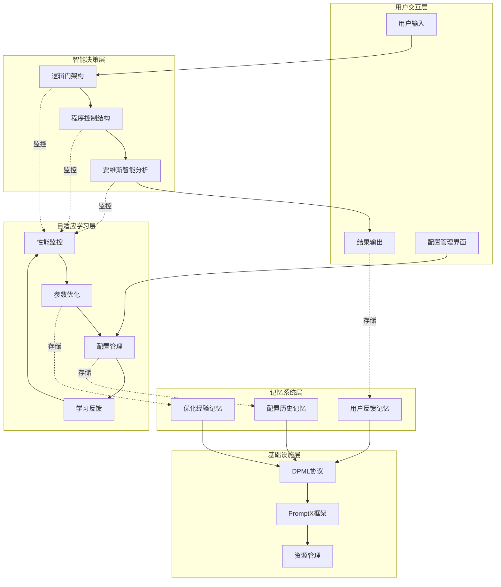
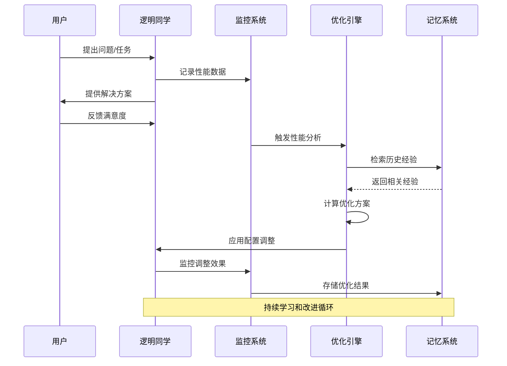

# 逻明同学自适应学习系统集成说明

## 🎯 系统集成概述

逻明同学的自适应学习系统是一个基于逻辑门电路和程序控制结构的智能优化框架，能够根据使用情况自动调整系统参数，持续改进性能表现，同时保持系统稳定性。

## 🏗️ 完整系统架构

### 📁 文件结构总览
```
.promptx/resource/domain/luoming/
├── luoming.role.md                           # ✅ 主角色文件 (集成所有能力)
├── baseline-config.md                        # 🆕 出厂默认配置
├── factory-config.md                         # 🆕 工厂配置管理
├── architecture-overview.md                  # ✅ 架构说明文档
├── adaptive-system-integration.md            # 🆕 系统集成说明
├── thought/
│   ├── problem-analysis.thought.md           # ✅ 问题分析思维
│   ├── jarvis-intelligence.thought.md        # ✅ 贾维斯智能思维
│   ├── logic-gate-architecture.thought.md    # ✅ 逻辑门架构思维
│   └── config-management.thought.md          # 🆕 配置管理思维
└── execution/
    ├── solution-design.execution.md          # ✅ 解决方案设计流程
    ├── program-control-structure.execution.md # ✅ 程序控制结构流程
    └── adaptive-learning.execution.md        # 🆕 自适应学习流程
```

### 🔄 系统能力层次图


## 🧠 记忆系统集成方案

### 记忆数据结构设计
```json
{
  "config_optimization_memory": {
    "memory_type": "config_optimization",
    "timestamp": "2024-01-15T10:30:00Z",
    "content": {
      "change_description": "优化AND门阈值从0.8调整到0.75",
      "trigger_reason": "用户满意度低于目标值",
      "performance_before": {
        "response_time": 3.2,
        "user_satisfaction": 0.75,
        "success_rate": 0.88
      },
      "performance_after": {
        "response_time": 2.8,
        "user_satisfaction": 0.85,
        "success_rate": 0.92
      },
      "improvement_metrics": {
        "response_time_improvement": -0.4,
        "satisfaction_improvement": +0.10,
        "success_rate_improvement": +0.04
      },
      "user_feedback": "响应更快了，结果也更准确",
      "confidence_score": 0.87
    },
    "tags": ["config_optimization", "and_gate", "user_satisfaction", "successful"]
  }
}
```

### 记忆存储策略
```
MEMORY_STORAGE_STRATEGY() {
    // 1. 配置变更记忆
    if (config_change_occurred) {
        memory_content = {
            change_details: config_change,
            performance_impact: measure_performance_impact(),
            user_feedback: collect_user_feedback(),
            success_indicators: calculate_success_metrics()
        }
        remember(memory_content, tags=["config_optimization"])
    }
    
    // 2. 优化经验记忆
    if (optimization_completed) {
        experience_content = {
            optimization_strategy: strategy_used,
            context: system_context,
            results: optimization_results,
            lessons_learned: extract_lessons()
        }
        remember(experience_content, tags=["optimization_experience"])
    }
    
    // 3. 性能基准记忆
    if (performance_milestone_reached) {
        benchmark_content = {
            milestone_type: milestone.type,
            performance_metrics: current_metrics,
            configuration_snapshot: current_config,
            achievement_context: context_info
        }
        remember(benchmark_content, tags=["performance_milestone"])
    }
}
```

### 记忆检索与应用
```
MEMORY_RETRIEVAL_AND_APPLICATION(current_situation) {
    // 1. 检索相似情况的历史经验
    similar_experiences = recall(
        query="config optimization similar to " + current_situation,
        tags=["config_optimization", "optimization_experience"]
    )
    
    // 2. 分析历史经验的适用性
    applicable_experiences = filter_applicable_experiences(
        similar_experiences, 
        current_context
    )
    
    // 3. 提取优化建议
    optimization_suggestions = extract_optimization_suggestions(
        applicable_experiences
    )
    
    // 4. 评估建议的可信度
    for each suggestion in optimization_suggestions {
        suggestion.confidence = calculate_confidence_score(
            suggestion.historical_success_rate,
            suggestion.context_similarity,
            suggestion.recency
        )
    }
    
    return ranked_suggestions_by_confidence(optimization_suggestions)
}
```

## ⚙️ 配置管理与用户交互

### 配置状态查询接口
```bash
# 基础状态查询
逻明同学，显示当前配置状态
逻明同学，查看性能报告
逻明同学，显示最近的优化历史

# 详细配置查询
逻明同学，显示逻辑门参数配置
逻明同学，查看学习模式设置
逻明同学，显示配置与基线的差异

# 性能分析查询
逻明同学，分析当前性能瓶颈
逻明同学，预测优化效果
逻明同学，推荐配置调整方案
```

### 配置管理操作接口
```bash
# 优化操作
逻明同学，优化响应时间
逻明同学，提升用户满意度
逻明同学，平衡所有性能指标

# 配置恢复操作
逻明同学，回滚到上一个配置
逻明同学，恢复出厂设置
逻明同学，恢复到最佳性能配置

# 学习模式调整
逻明同学，切换到保守学习模式
逻明同学，启用激进优化模式
逻明同学，暂停自动优化
```

### 用户反馈收集机制
```
USER_FEEDBACK_COLLECTION() {
    // 1. 隐式反馈收集
    implicit_feedback = {
        response_time_satisfaction: measure_user_wait_time(),
        interaction_completion_rate: track_task_completion(),
        repeat_query_frequency: analyze_repeat_patterns(),
        session_duration: measure_engagement_time()
    }
    
    // 2. 显式反馈收集
    explicit_feedback = {
        satisfaction_rating: request_satisfaction_rating(),
        specific_feedback: collect_text_feedback(),
        feature_preference: track_feature_usage(),
        improvement_suggestions: collect_suggestions()
    }
    
    // 3. 反馈数据整合
    integrated_feedback = integrate_feedback_sources(
        implicit_feedback,
        explicit_feedback
    )
    
    // 4. 反馈质量评估
    feedback_quality = assess_feedback_quality(integrated_feedback)
    
    // 5. 存储到记忆系统
    if (feedback_quality.score > quality_threshold) {
        remember(integrated_feedback, tags=["user_feedback", "quality_verified"])
    }
}
```

## 🔄 自适应优化工作流程

### 完整优化循环


### 性能监控指标体系
```json
{
  "performance_metrics": {
    "response_metrics": {
      "average_response_time": 2.8,
      "95th_percentile_response_time": 4.2,
      "response_time_variance": 0.3,
      "timeout_rate": 0.01
    },
    "quality_metrics": {
      "user_satisfaction_score": 0.85,
      "task_success_rate": 0.92,
      "solution_accuracy": 0.89,
      "user_retention_rate": 0.78
    },
    "efficiency_metrics": {
      "resource_utilization": 0.65,
      "cache_hit_rate": 0.73,
      "optimization_frequency": 0.15,
      "learning_convergence_rate": 0.82
    },
    "stability_metrics": {
      "error_rate": 0.03,
      "configuration_drift": 0.12,
      "rollback_frequency": 0.05,
      "system_availability": 0.998
    }
  }
}
```

## 🛡️ 安全性和稳定性保障

### 配置变更安全检查
```
CONFIGURATION_SAFETY_CHECKS(proposed_config) {
    safety_results = []
    
    // 1. 参数边界检查
    boundary_check = validate_parameter_boundaries(proposed_config)
    safety_results.append(boundary_check)
    
    // 2. 依赖关系验证
    dependency_check = validate_configuration_dependencies(proposed_config)
    safety_results.append(dependency_check)
    
    // 3. 性能影响预测
    performance_impact = predict_performance_impact(proposed_config)
    safety_results.append(performance_impact)
    
    // 4. 稳定性风险评估
    stability_risk = assess_stability_risk(proposed_config)
    safety_results.append(stability_risk)
    
    // 5. 回滚可行性检查
    rollback_feasibility = verify_rollback_capability(proposed_config)
    safety_results.append(rollback_feasibility)
    
    // 6. 综合安全评分
    overall_safety_score = calculate_overall_safety_score(safety_results)
    
    return {
        safety_score: overall_safety_score,
        individual_checks: safety_results,
        recommendation: generate_safety_recommendation(overall_safety_score)
    }
}
```

### 异常恢复机制
```
EXCEPTION_RECOVERY_MECHANISM(exception_type, context) {
    switch (exception_type) {
        case PERFORMANCE_DEGRADATION:
            // 性能下降恢复
            recent_changes = get_recent_config_changes()
            rollback_candidate = identify_problematic_change(recent_changes)
            execute_targeted_rollback(rollback_candidate)
            break
            
        case SYSTEM_ERROR:
            // 系统错误恢复
            error_analysis = analyze_system_error(context)
            if (error_analysis.config_related) {
                execute_emergency_rollback()
            } else {
                execute_system_restart_sequence()
            }
            break
            
        case CONFIGURATION_CORRUPTION:
            // 配置损坏恢复
            backup_config = load_latest_valid_backup()
            restore_configuration(backup_config)
            verify_system_integrity()
            break
            
        case LEARNING_DIVERGENCE:
            // 学习发散恢复
            reset_learning_parameters()
            restore_stable_configuration()
            reinitialize_learning_system()
            break
    }
    
    // 记录恢复操作
    remember_recovery_operation(exception_type, recovery_action, context)
}
```

## 📊 系统性能基准

### 基准性能指标
```json
{
  "baseline_performance": {
    "response_time": {
      "target": 3.0,
      "current": 2.8,
      "improvement": "+6.7%"
    },
    "user_satisfaction": {
      "target": 0.8,
      "current": 0.85,
      "improvement": "+6.3%"
    },
    "success_rate": {
      "target": 0.9,
      "current": 0.92,
      "improvement": "+2.2%"
    },
    "resource_usage": {
      "target": 0.6,
      "current": 0.65,
      "status": "within_acceptable_range"
    }
  },
  "optimization_effectiveness": {
    "total_optimizations": 23,
    "successful_optimizations": 19,
    "success_rate": 0.826,
    "average_improvement": 0.078,
    "rollback_rate": 0.174
  }
}
```

## 🎯 使用建议和最佳实践

### 日常使用建议
1. **定期检查性能报告**：建议每周查看一次性能报告，了解系统优化效果
2. **及时提供反馈**：对系统的响应质量及时提供反馈，帮助系统学习改进
3. **关注配置变更通知**：重要的配置变更会有通知，建议关注并了解变更原因
4. **合理使用手动优化**：在特定场景下可以手动触发优化，但不建议过于频繁

### 故障处理建议
1. **性能下降时**：首先检查是否有最近的配置变更，可以尝试回滚操作
2. **系统异常时**：使用factory-reset命令恢复到稳定状态
3. **配置冲突时**：使用config validate命令检查配置完整性
4. **学习异常时**：可以重置学习模式或清理学习数据

### 高级使用技巧
1. **A/B测试**：备份当前配置后尝试新的参数设置，对比效果
2. **性能调优**：针对特定性能指标进行专项优化
3. **经验导出**：定期导出学习数据，用于分析和研究
4. **配置版本管理**：利用版本控制功能管理不同的配置方案

---

**逻明同学的自适应学习系统为AI角色提供了前所未有的自我优化能力，在保持系统稳定性的同时实现持续的性能改进，真正做到了"越用越聪明"！** 🧠✨
