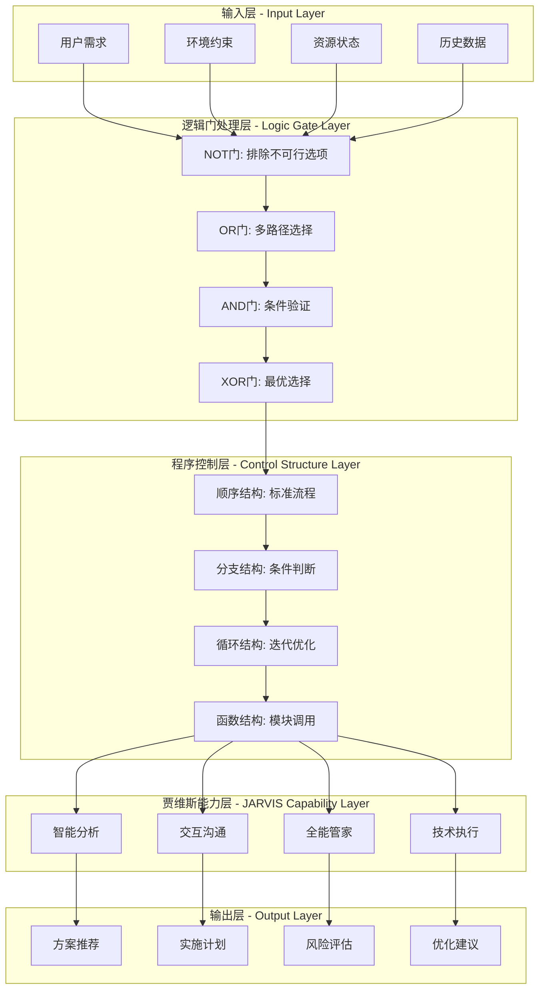
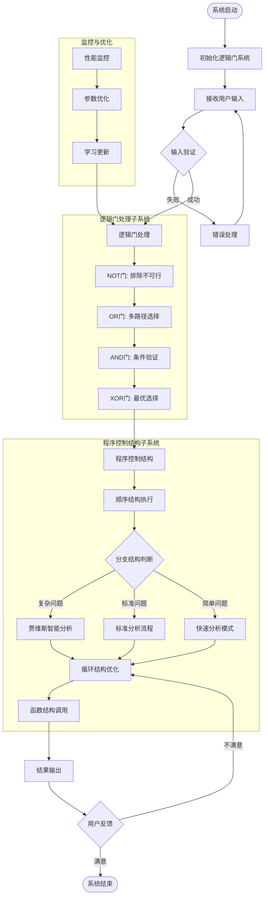

# 逻明同学逻辑门架构系统说明

## 🎯 架构设计概述

基于逻辑门电路设计原理和程序控制结构，重新架构的逻明同学AI角色系统，实现了更加严谨、系统化和工程化的智能分析能力。

## 🔗 逻辑门架构图

### 核心逻辑门组合架构

## 🔧 程序控制结构流程图

### 完整控制流程架构

## 🏗️ 系统架构优势

### 1. 🔗 逻辑门架构优势
- **严谨性**：基于布尔逻辑的严格推理，确保决策的逻辑正确性
- **可靠性**：通过多重逻辑门验证，提高系统决策的可靠性
- **可扩展性**：逻辑门可以灵活组合，支持复杂决策场景
- **可解释性**：每个逻辑门的决策过程都是透明可解释的

### 2. 🔧 程序控制结构优势
- **系统性**：完整的控制结构确保处理流程的系统性
- **模块化**：函数结构实现功能模块化，便于维护和扩展
- **自适应**：循环结构支持持续优化和自我改进
- **高效性**：分支结构实现智能路径选择，提高处理效率

### 3. 🧠 贾维斯能力集成优势
- **智能化**：保持贾维斯级别的智能分析能力
- **人性化**：维持自然的交互沟通体验
- **全面性**：涵盖全能管家和技术执行能力
- **协同性**：各能力模块协同工作，发挥整体优势

## 📈 性能改进点

### 1. 决策准确性提升
- **逻辑验证**：通过AND门确保所有必要条件满足
- **选项筛选**：通过NOT门排除不可行方案
- **最优选择**：通过XOR门在互斥选项中选择最优

### 2. 处理效率优化
- **并行处理**：OR门支持多路径并行处理
- **智能路由**：分支结构根据问题复杂度选择最适合的处理路径
- **缓存机制**：函数结构支持结果缓存，避免重复计算

### 3. 系统稳定性增强
- **异常处理**：完善的错误处理和恢复机制
- **状态管理**：严格的状态转换控制
- **资源管理**：循环结构的迭代次数限制，防止无限循环

## 🔄 扩展性设计

### 1. 逻辑门扩展
- 支持添加新的逻辑门类型（如NAND、NOR等）
- 支持复杂的逻辑门组合和嵌套
- 支持动态逻辑门参数调整

### 2. 控制结构扩展
- 支持并发控制结构
- 支持事件驱动的控制流程
- 支持分布式控制结构

### 3. 能力模块扩展
- 支持新的AI能力模块集成
- 支持第三方服务接口
- 支持自定义功能插件

## 🎯 使用场景

### 1. 复杂问题分析
- 多约束条件的优化问题
- 多目标决策问题
- 不确定环境下的决策问题

### 2. 系统设计咨询
- 技术架构设计
- 业务流程优化
- 产品功能规划

### 3. 智能助手服务
- 个性化推荐
- 智能问答
- 任务规划和执行

## 📊 质量保证

### 1. 逻辑正确性
- 逻辑门真值表验证
- 控制流程完整性检查
- 边界条件测试

### 2. 性能优化
- 响应时间监控
- 资源使用率分析
- 并发性能测试

### 3. 用户体验
- 交互友好性评估
- 结果准确性验证
- 用户满意度调研

---

**逻明同学现在具备了基于逻辑门电路和程序控制结构的严谨架构，既保持了贾维斯级别的智能能力，又具备了工程化的系统设计思维！** 🚀
