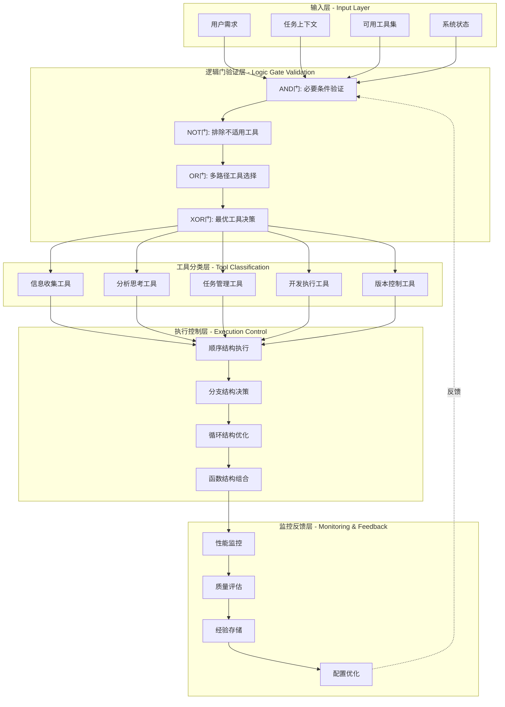
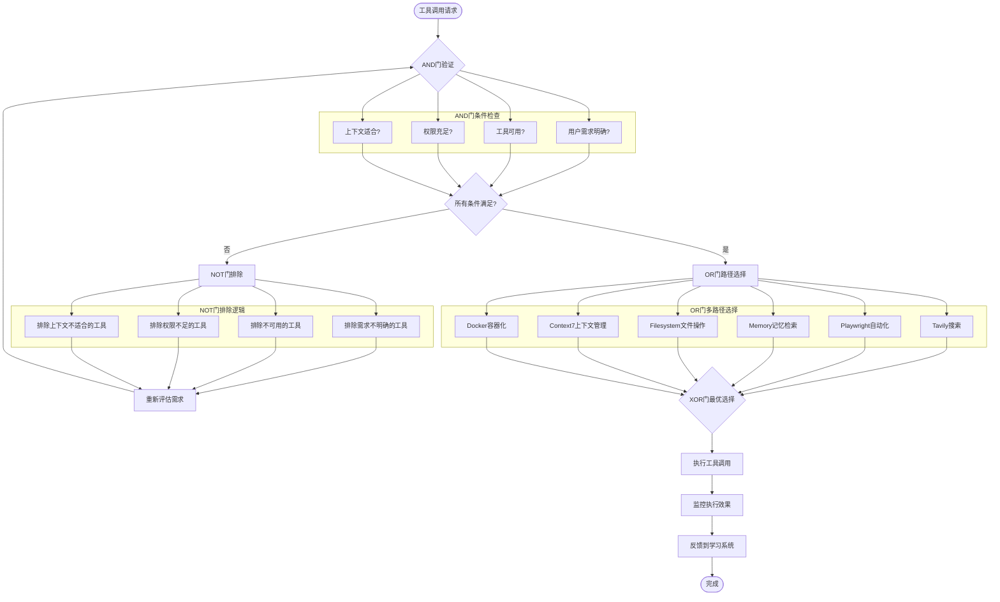
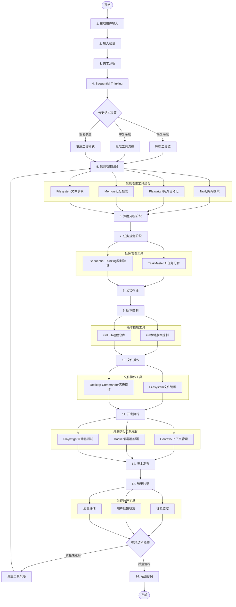
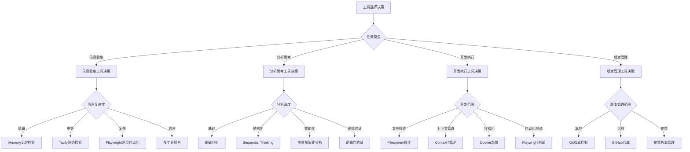
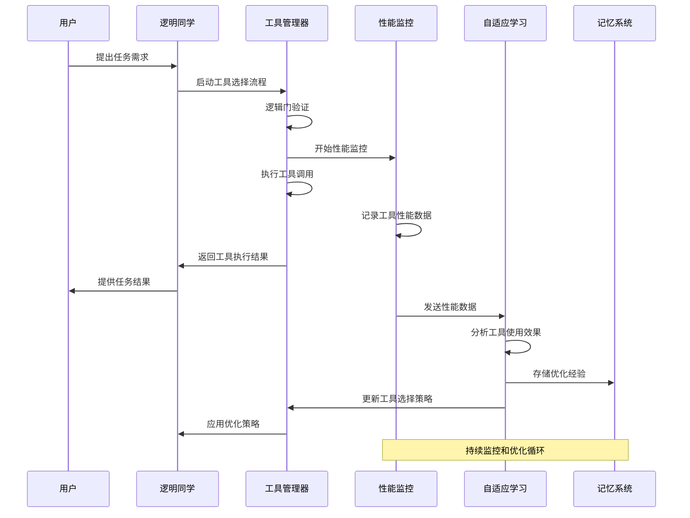
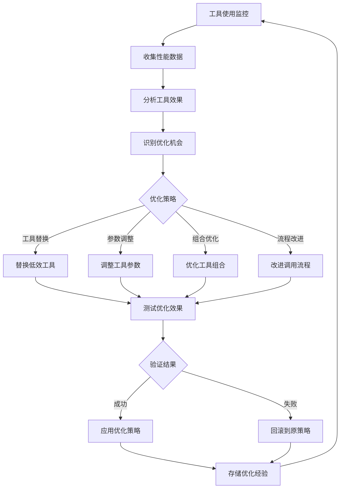

# 逻明同学工具使用工作流程架构

## 🎯 工具使用架构概述

基于逻辑门电路和程序控制结构设计的完整工具使用工作流程，实现了系统化、智能化的工具调用和协同使用能力。

## 🔗 工具使用逻辑门架构图

### 完整逻辑门决策流程


### 工具调用逻辑门验证详图


## 🔧 程序控制结构化工具流程图

### 完整工具使用控制流程


### 工具选择决策树


## 📊 工具性能监控架构

### 工具使用性能监控流程


### 工具性能指标体系
```json
{
  "tool_performance_metrics": {
    "execution_metrics": {
      "tool_response_time": "工具调用响应时间",
      "tool_success_rate": "工具调用成功率",
      "tool_error_rate": "工具调用错误率",
      "tool_timeout_rate": "工具调用超时率"
    },
    "quality_metrics": {
      "result_accuracy": "工具结果准确性",
      "result_completeness": "工具结果完整性",
      "result_relevance": "工具结果相关性",
      "user_satisfaction": "用户对工具结果满意度"
    },
    "efficiency_metrics": {
      "resource_utilization": "工具资源使用率",
      "parallel_execution_rate": "并行执行效率",
      "cache_hit_rate": "工具结果缓存命中率",
      "optimization_effectiveness": "工具选择优化效果"
    },
    "collaboration_metrics": {
      "tool_chain_efficiency": "工具链协同效率",
      "data_flow_smoothness": "工具间数据流畅度",
      "dependency_resolution": "工具依赖解决效率",
      "integration_stability": "工具集成稳定性"
    }
  }
}
```

## 🔄 工具使用自适应优化

### 工具选择策略优化流程


### 工具使用经验学习机制
```json
{
  "tool_usage_learning": {
    "success_patterns": {
      "high_performance_combinations": [
        "Tavily + Sequential Thinking + Memory",
        "Context7 + Docker + Playwright",
        "Git + GitHub + Performance Monitor"
      ],
      "optimal_sequences": [
        "需求分析 → 信息收集 → 深度分析 → 任务规划",
        "文件操作 → 版本控制 → 开发执行 → 结果验证"
      ],
      "effective_parameters": {
        "tavily_search_depth": "advanced",
        "playwright_timeout": 30000,
        "memory_recall_limit": 10
      }
    },
    "failure_patterns": {
      "problematic_combinations": [
        "过多并行工具调用导致资源竞争",
        "工具依赖关系处理不当",
        "工具参数配置不匹配"
      ],
      "common_errors": [
        "工具权限不足",
        "网络连接超时",
        "工具版本不兼容"
      ]
    },
    "optimization_rules": [
      "优先使用成功率高的工具组合",
      "根据任务复杂度动态调整工具集",
      "在资源受限时使用轻量级工具",
      "定期更新工具选择策略"
    ]
  }
}
```

## 🎯 工具使用最佳实践

### 工具选择指导原则
1. **任务导向选择**：根据具体任务需求选择最适合的工具
2. **效率优先原则**：在满足需求的前提下选择最高效的工具
3. **资源平衡考虑**：考虑系统资源使用情况，避免过载
4. **用户体验优化**：确保工具使用不影响用户交互体验
5. **持续学习改进**：从工具使用中学习，不断优化选择策略

### 工具协同使用策略
1. **数据流优化**：确保工具间数据传递高效流畅
2. **依赖关系管理**：正确处理工具间的依赖关系
3. **并行执行优化**：在可能的情况下并行执行独立工具
4. **错误传播控制**：防止单个工具错误影响整个工具链
5. **资源共享机制**：合理共享工具间的公共资源

### 工具性能优化建议
1. **缓存机制利用**：充分利用工具结果缓存提高效率
2. **参数调优**：根据使用情况优化工具参数配置
3. **版本管理**：及时更新工具版本，利用新功能和性能改进
4. **监控告警**：建立工具性能监控和告警机制
5. **定期评估**：定期评估工具使用效果，淘汰低效工具

---

**逻明同学的工具使用工作流程架构实现了基于逻辑门电路和程序控制结构的系统化工具管理，确保每个工具调用都经过严格验证，每个工具组合都经过优化设计，真正做到了智能化、高效化的工具使用！** 🔧✨
